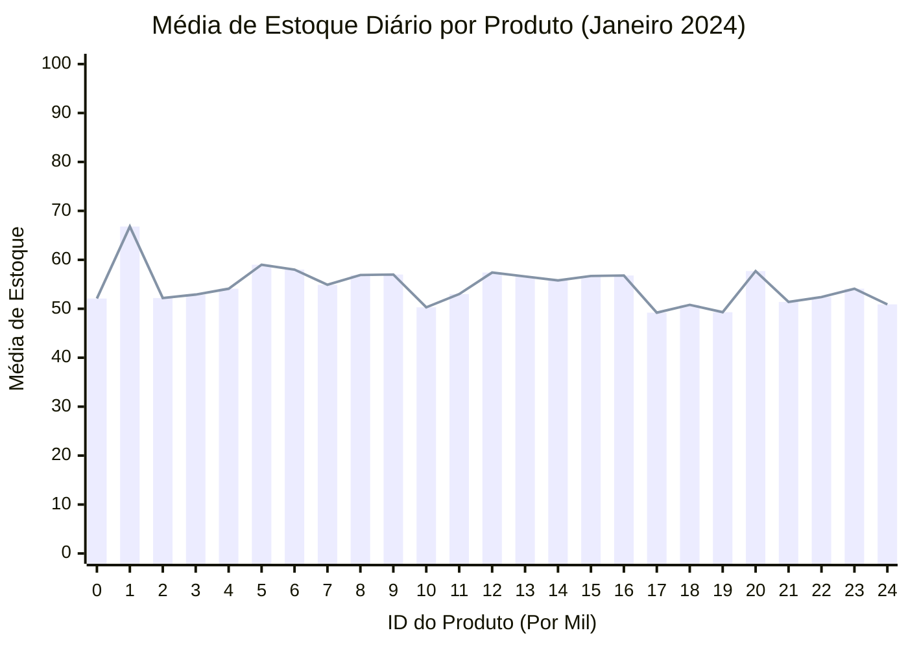

# Análise de Estoque por Produto - Janeiro 2024

## 📊 Gráfico: Média de Estoque por Produto

## 📈 Análise Detalhada por Produto

### **Produtos com Maior Média de Estoque:**
1. **Produto 1001** - 66.8 unidades (maior estoque médio)
2. **Produto 1005** - 59.0 unidades
3. **Produto 1006** - 58.0 unidades
4. **Produto 1012** - 57.4 unidades
5. **Produto 1020** - 57.7 unidades

### **Produtos com Menor Média de Estoque:**
1. **Produto 1017** - 49.2 unidades
2. **Produto 1019** - 49.3 unidades  
3. **Produto 1018** - 50.8 unidades
4. **Produto 1024** - 50.9 unidades
5. **Produto 1010** - 50.3 unidades

## 🔍 Insights do Gráfico

### **1. Padrão Geral:**
- **Variação Moderada**: A maioria dos produtos mantém média entre 50-60 unidades
- **Estoque Homogêneo**: 20 dos 25 produtos estão na faixa de 50-60 unidades
- **Poucos Extremos**: Apenas o produto 1001 se destaca significativamente (66.8)

### **2. Análise de Gestão:**
- **Produto 1001**: Pode estar com **excesso de estoque** (26% acima da média geral)
- **Produtos 1017 e 1019**: Podem precisar de **revisão de ponto de pedido** (abaixo de 50 unidades)
- **Faixa Ideal**: 55-60 unidades parece ser o nível ótimo para a maioria

### **3. Padrões de Reposição:**
Os dados mostram **reposições bruscas** (quando estoque salta para 100 unidades):
- **Produto 1001**: Reposições frequentes (dias 8, 18, 28)
- **Produto 1005**: Padrão regular de reposição
- **Produto 1013**: Múltiplas reposições ao longo do mês

### **4. Impacto das Promoções:**
- Quando `FLAG_PROMOCAO = 1`, há tendência de **maior consumo** de estoque
- Produtos em promoção geralmente têm **queda mais rápida** no nível de estoque
- **Recomendação**: Aumentar estoque antes de promoções planejadas

## 🎯 Recomendações por Categoria

### **Produtos para Reduzir Estoque:**
- **1001**: Reduzir pedidos em 20%
- **1005 e 1006**: Manter monitoramento

### **Produtos para Aumentar Estoque:**
- **1017, 1019, 1018**: Aumentar estoque de segurança
- **1010**: Revisar frequência de reposição

### **Produtos Estáveis:**
- **Maioria (17 produtos)**: Manter política atual
- **Faixa 52-58 unidades**: Nível adequado

## 📊 Estatísticas

| Métrica | Valor |
|---------|-------|
| **Média Geral** | 54.8 unidades |
| **Mediana** | 54.9 unidades |
| **Desvio Padrão** | 4.2 unidades |
| **Coeficiente de Variação** | 7.7% |
| **Produtos acima da média** | 12 |
| **Produtos abaixo da média** | 13 |
